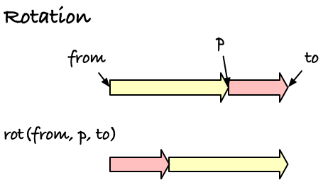
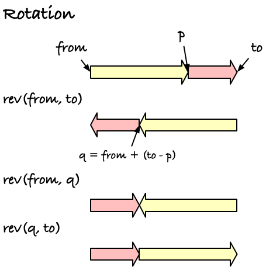
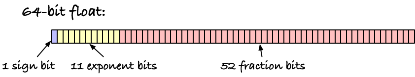

# Radix sorting signed integers and floats

We know how to [bucket sort](https://github.com/birc-stormtroopers/bucket-sort) which means we also know how to radix sort. That's because to radix sort, we just need to iteratively bucket sort through a key.

You can do this in two directions, from left to right or right to left (also known as *most-significant digit first* (MSD) or *least-significant digit first* (LSD)). [Here's some description from a GSA exercise, but without the code (it is an exercise, after all)](https://github.com/birc-gsa/radix-sa).

I find that the least-significant digit first radix sort is the easiest, because it really just is repeating a bucket sort some $k$ times. If you have a key with `w` bits, you can split it into `k` sub-keys of size `w/k` and then bucket sort from right to left `k` times.

Say your keys are 64 bit integers. We can't bucket sort these directly, since we would need $2^{64} \approx 1.84\times 10^{19}$ buckets, and we don't have that kind of memory on our computers. But 64 bits is just 8 bytes of 8 bits, and sorting bits require only 256 buckets. If we split our keys into eight sub-keys, we can bucket sort with 256 buckets and be done after eight bucket sorts.

A C implementation of this could look like this:

```c
// How many bits do we sort at a time
// and the mask we use to extract them
#define BUCKET_BITS 8
#define BUCKET_MASK 0xFF

// The number of buckets we need for that
#define NO_BUCKETS (1 << BUCKET_BITS)

// And the number of keys that leaves in a word
#define NO_KEYS(WSIZE) (WSIZE / BUCKET_BITS)

// Give us the K'th sub-key for a key
#define BUCKET_KEY(KEY, K, WSIZE) \
    (((KEY) >> (K * BUCKET_BITS)) & BUCKET_MASK)

// Sort n keys into buf using the sub-key k. Buckets is a helper
// buffer that the caller must allocate.
void bsort(size_t n, uint64_t keys[n], uint64_t buf[n],
           int k, size_t buckets[NO_BUCKETS])
{
    // Count the keys
    memset(buckets, 0, NO_BUCKETS * sizeof *buckets);
    for (size_t i = 0; i < n; i++)
        buckets[BUCKET_KEY(keys[i], k, 64)]++;

    // Then compute the cumulative sum
    unsigned int acc = 0, b;
    for (size_t i = 0; i < NO_BUCKETS; i++)
    {
        b = buckets[i];
        buckets[i] = acc;
        acc += b;
    }

    // Place the keys into buf.
    for (size_t i = 0; i < n; i++)
        buf[buckets[BUCKET_KEY(keys[i], k, 64)]++] = keys[i];
}

void rsort_uint64(size_t n, uint64_t keys[n])
{
    uint64_t *buf = malloc(n * sizeof *buf);
    size_t *buckets = malloc(NO_BUCKETS * sizeof *buckets);

    // It's important that we run an even number of times, but we
    // will for reasonable choices of word sizes and bucket sizes.
    uint64_t **b1 = &keys, **b2 = &buf;
    for (int b = 0; b < NO_KEYS(64); b++)
    {
        bsort(n, *b1, *b2, b, buckets);
        swap(b1, b2);
    }

    free(buckets);
    free(buf);
}
```

Easy-peasy. But this does rely on keys that we can split into sub-keys that we can sort as their bit-patterns interpreted as bytes. That isn't always the case.

If we were to sort signed 64-bit integers instead, we would run into a problem. Negative numbers are represented in [two's-complement](https://en.wikipedia.org/wiki/Two's_complement) and if we sorted signed integers as if they were unsigned, the negative numbers would be sorted after the positive, as the negative numbers have the highest bit set while the positive integers have not.

Other than that, though, the negative numbers would still be correctly sorted. The negative numbers in two's compliment are still ordered such that if `i < j` then the bit patterns interpreted as unsigned integers would also be ordered `i < j`. It is only that the negative numbers come after the positive.

The 4-bit unsigned and two's complement integers:

```
Bits  Unsigned  Signed
0000         0       0
0001         1       1
0010         2       2
0011         3       3
0100         4       4
0101         5       5
0110         6       6
0111         7       7
1000         8      -8 (-8 = ~8 + 1 = ~1000 + 1 = 0111 + 1 = 1000)
1001         9      -7 (-7 = ~7 + 1 = ~0111 + 1 = 1000 + 1 = 1001)
1010        10      -6 (-6 = ~6 + 1 = ~0110 + 1 = 1001 + 1 = 1010)
1011        11      -5 (-5 = ~5 + 1 = ~0101 + 1 = 1010 + 1 = 1011)
1100        12      -4 (-4 = ~4 + 1 = ~0100 + 1 = 1011 + 1 = 1100)
1101        13      -3 (-3 = ~3 + 1 = ~0011 + 1 = 1100 + 1 = 1101)
1110        14      -2 (-2 = ~2 + 1 = ~0010 + 1 = 1101 + 1 = 1110)
1111        15      -1 (-1 = ~1 + 1 = ~0001 + 1 = 1110 + 1 = 1111)
```

We can fix that by rotating the array after we have sorted it, so the negative numbers are moved to the front and the positive numbers are put after.



The easiest way to rotate an array in-place (thus saving some memory) is using reversal. You can reverse the whole array, and then reverse the two parts you are rotating, and, presto, you have rotated the array.




Both operations are straightforward to implement:

```c
// Reverse the values in [from, to).
static void reverse(uint64_t *from, uint64_t *to)
{
    for (to--; from < to; from++, to--)
    {
        swap(*from, *to);
    }
}

// Rotate [from, p)[p, to) to [p, to)[from, to)
static void rotate(uint64_t *from, uint64_t *p, uint64_t *to)
{
    //  from    p
    //  [.....][...............]
    //  [...............][.....]
    //                   q
    uint64_t *q = to - (p - from);
    reverse(from, to);
    reverse(from, q);
    reverse(q, to);
}
```

That means that once we have sorted our signed integers as if they were unsigned, we just need to find out where the negative numbers start, and rotate around that point.

You can always just search for the first value `x[i] < 0`, but I am going to need this for more than just signed integers, so I wrote a function that checks for the first value that has bit `63` set. It works as a sign bit both in two's-complement 64-bit signed integers and in 64-bit floats.

```c
// Find the first negative number in [from,to), where
// negative means that the "sign bit" (bit 63) is set.
// If no negative number is found, return to.
#define SIGN_BIT(WORD) ((WORD >> 63) & 0x01)
static uint64_t *first_neg(uint64_t *from, uint64_t *to)
{
    for (; from != to; from++)
        if (SIGN_BIT(*from))
            break;
    return from;
}
```

If you don't need (relatively) generic code, you can just us `x < 0` for integers or `signbit()` for floats (where `x < 0` won't work, since `-0` is a thing for floats).

With a sorting function for unsigned 64-bit integers and the rotation functionality, the sorting routine for signed integers practically writes itself:

```c
void rsort_int64(size_t n, int64_t keys_[n])
{
    uint64_t *keys = (uint64_t *)keys_; // We actually work on uint64_t

    // Sort as unsigned
    rsort_uint64(n, keys);
    // Then rotate the negative numbers first
    rotate(keys, first_neg(keys, keys + n), keys + n);
}
```

Now that we're comfortable with the idea of sorting keys as unsigned integers and then possibly do some rearrangement after, we might wonder if we could do the same thing with floating point numbers. After all, in many bioinformatics applications we are working with floats in various disguises, and sometimes we want an efficient sort of those.

The standard representation for floating point numbers today is [IEEE 754](https://en.wikipedia.org/wiki/IEEE_754#2019). It is a bit complicated, as most standards are, especially because it allows decimal floats, which is just crazy and a lot harder to work with than binary numbers. If those decimal floats are used anywhere, I don't know, but I plan to live a long and happy life ignoring their existance.

For a binary float, you have a sign bit, $s$,
then some bits for an exponent, $e$,
which in 64-bit floats is 11 bits, and finally some "fraction"bits, for 64-bit floats there are 52: $b_0,b_1,\ldots,b_51$.



The interpretation is this:

$$x = (-1)^s \left(1 + \sum_{i=1}^{52} b_{52-i}2^{-i}\right) \times 2^{e-1023}$$

There are some special cases, some of which we can ignore and some of which we have to deal with.

First, if we just consider this a bit pattern and ignore the sign bit (i.e., we are working with positive numbers and positive zero), we can just sort floats as if they were bit patterns.

If we sort such a bit pattern, the higher bits are the main keys, which would mean that the exponent matters more than the fractions. That is exactly what we want since $2^a < 2^b$
when $a < b$. After the exponent, the bit pattern will be sorted with respect to the fraction, which is also exactly what we want.

If we then add the sign bit to the equation, we have a little more work to do. The sign bit will put negative numbers after the positive numbers, so we need a rotation to get the negative numbers first and the positive numbers second. With two's-complement integers, that woudl be enough to get all the values in order, but with floats we don't have two's-complement. The sign bit is just a sign bit. So the negative numbers go

```
-0:   1 ... 00000
-1:   1 ... 00001
-2:   1 ... 00010
-3:   1 ... 00011
...
```

which, when sorted as bit-patterns, would put the negative numbers in reverse.

No problem, though, we have a function for reversing parts of an array and we are not afraid to use it.

Then there are some special interpretations of bit patterns that are not directly translated with the formula above. These are encoded in the exponent.

The smallest exponent is (obviously) zero `0x000` and the highest is `0x7ff`. When the exponent is zero, the other bits are potentially interpreted differently. If the sign bit is set and the fraction is all zeros, the number is interpreted as negative zero (-0). So `-0 = 0b100...0000`. As a bit pattern, that is the smallest number with the sign bit set, and with our transformations this will place it right before 0, which is a fine place for negative zero. No problem there.

When the exponent is zero and the fraction is non-zero we get what is called "subnormal" numbers. It is just a different interpretation of the fractions. Now the number is interpreted as

$$(-1)^s \times 2^{1-1023} \times 0.b_{51}b_{50}\ldots b_1b_0$$

which places the numbers in the smallest interval around zero where we don't have a positive exponent, but uniformly placed. The bit patterns in the fraction still sort correctly, though, and the transformation based on the sign bit orders them correctly.


To sum up, if we sort 64-bit floating point numbers in IEEE 754, we can sort them as 64-bit unsigned integers, but then we need to rotate the negative numbers up front to get the sign ordered, and then we need to reverse the negative numbers to get them in order.[^1]

```c
void rsort_float64(size_t n, float64_t keys_[n])
{
    // Just sort as integers. This requires that the representation is big-endian
    // so the bytes are in the same order as IEEE 754.
    uint64_t *keys = (uint64_t *)keys_; // We actually work on uint64_t
    rsort_uint64(n, keys);

    // Then rotate to get the negative/positive numbers in the right order
    size_t no_pos = first_neg(keys, keys + n) - keys;
    size_t no_neg = n - no_pos;
    rotate(keys, keys + no_pos, keys + n);
    // and reverse the negative numbers (they are not two's compliment so
    // they are bit-wise sorted and thus in the wrong order).
    reverse(keys, keys + no_neg);
}
```

A word of warning on casting is in order her. I am casting an array of `float64_t` to an array of `uint64_t`, which means that I tell C to consider that array of a different type. That means that whatever bits are in the original array are also in the new array--because it is the same array--they are just interpreted in a different way.

This is what I want here, but it is not always what a cast will give me. And for good reasons.

**FIXME: more here**


[^1]: If you are sorting more complicated values, and the floats are just keys, this last reversal will be unstable. You are reversing the values compared to the order they had in the input. To fix this, you will have to run through the negative numbers and for each block of identical keys you need to reverse the block. That brings the algorithm back to a stable sort.
